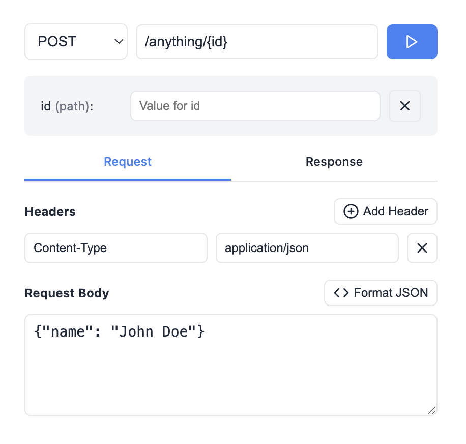

# http-api-test-iframe
Simple component that can be embedded as an iframe to test the HTTP API.

## Demo

```html
<iframe
    style="border: 0;"
    width="60%"
    src='https://lucasmenendez.github.io/http-api-test-iframe/?conf={"baseUrl": "https://httpbin.org","defaultPath": "/anything/{id}","defaultMethod": "POST"}'
    onload='javascript:(function(o){o.style.height=o.contentWindow.document.body.scrollHeight+"px";}(this));'
></iframe>
```

<br/>

<div style="text-align: center;">
    
</div>

## Default configuration

```javascript
const defaultConfig = {
    baseUrl: "https://api.example.com",
    defaultPath: "/users/{id}",
    defaultMethod: "GET",
    defaultHeaders: {
        "Content-Type": "application/json",
    },
    defaultBody: '{"name": "John Doe"}',
    excludedMethods: [],
}
```
